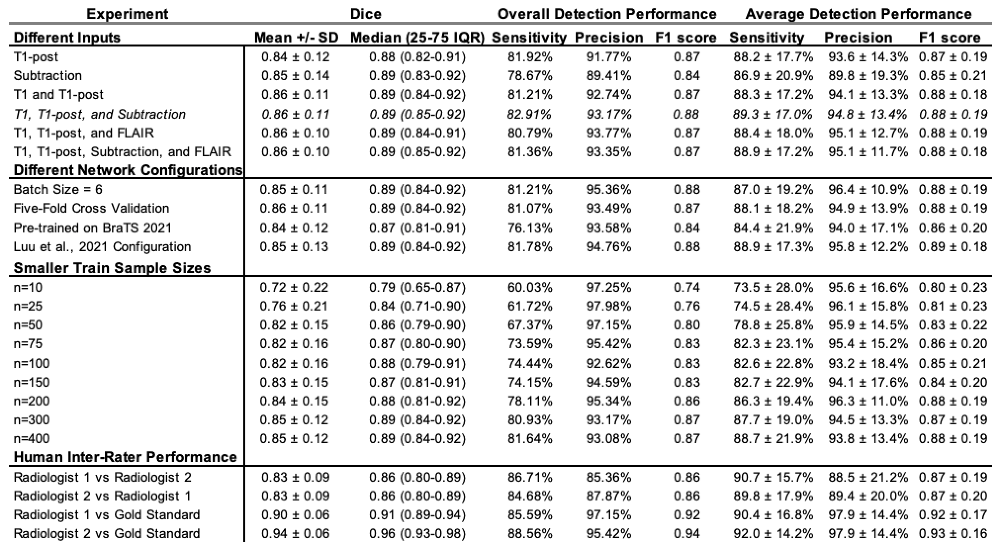

# UCSF-BMSR-benchmarks

The official nnUNet benchmarks for [The University of California San Francisco Brain Metastases Stereotactic Radiosurgery (UCSF-BMSR) dataset](https://pubs.rsna.org/doi/abs/10.1148/ryai.230126).

## Requirements - 

Please install [nnUNetV1](https://github.com/MIC-DKFZ/nnUNet/tree/nnunetv1) in developer mode. To conduct experiments on the Brats2021 winner model you will have to download another [nnUNet](https://github.com/rixez/Brats21_KAIST_MRI_Lab) variation.

## Code - 

Please look at the notebooks folder to conduct your own experminets using nnUNetv1. Using that code you can also reproduce the same model files that we are sharing in this paper. 

We have 3 notebooks. 
- The first notebook helps to perform standard nnUNetv1 experiments on the dataset.
- The second notebook helps to perform nnUNetv1 experiments where the patch size and batch size can be changed. We also provide details on how to fine-tune a model to this particular dataset.
- The third notebook helps to perform experiments using the [Brats2021 winner model](https://github.com/rixez/Brats21_KAIST_MRI_Lab).

## Pre-trained Models -

All important models are available [here](https://drive.google.com/file/d/1JpiCMlaUI75FAI2O2kzbykxt8Oo930Do) for download. 

These are nnUNetv1 models that have been exported to zip files using the `nnUNet_export_model_to_zip` command. To use them, all you have run is `nnUNet_install_pretrained_model_from_zip`, and you will be able to run any of the models. 

We provide 5 models for the UCSF-BMSR dataset as benchmarks.
- **Metastases_Subtraction**: Model that takes input as the (1) subtraction of T1Post and T1Pre MR image.
- **Metastases_T1post_T1pre_FLAIR_Subtraction**: Model that takes input as the (1) T1Post image (2) T1Pre image (3) FLAIR image and the (4) subtraction of T1Post and T1Pre MR image.
- **Metastases_T1post_T1pre_FLAIR**: Model that takes input as the (1) T1Post image (2) T1Pre image and (3) FLAIR image.
- **Metastases_T1post_T1pre**: Model that takes input as the (1) T1Post image and (2) T1Pre image.
- **Metastases_T1post**: Model that takes input as the (1) T1Post image.

We also provide 2 skull stripping models for FLAIR and T1Post skullstripping respectively. 

Following are the performance metrics for all the experiments performed in this project. 



## Citation - 

If you have used this work in your project, considering citing this research paper. 

```
@article{rudie2024university,
  title={The University of California San Francisco, Brain Metastases Stereotactic Radiosurgery (UCSF-BMSR) MRI Dataset},
  author={Rudie, Jeffrey D and Saluja, Rachit and Weiss, David A and Nedelec, Pierre and Calabrese, Evan and Colby, John B and Laguna, Benjamin and Mongan, John and Braunstein, Steve and Hess, Christopher P and others},
  journal={Radiology: Artificial Intelligence},
  pages={e230126},
  year={2024},
  publisher={Radiological Society of North America}
}

```

## Usage - 

Data and models cannot be used for commerical use. 

